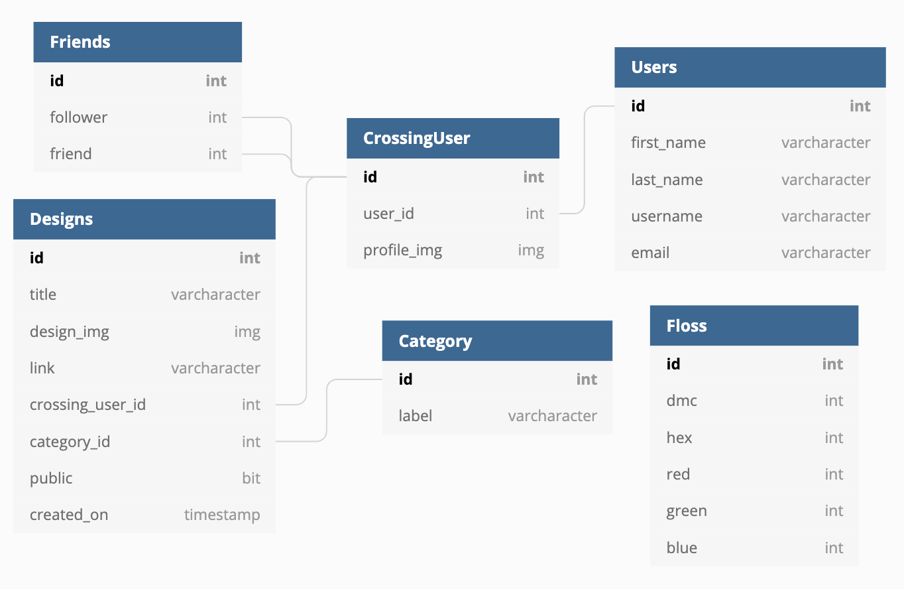

# Welcome to Crossing Paths!

> A social media app for people who love to Cross-Stitch! 

## The Idea

One day I was sitting with graph paper and markers copying a cross-stitch design from the internet and thought it would be cool if there was a way to create designs using a computer. From that idea, I decided to make this project adding a few other features to make it more like a social media app.

## Features

This app allows users to create, post, and organize cross-stitch designs. <br />
Features include:
* A Homepage where a user can organize their designs into three categories and add new designs
* A Friends page where users can manage who they follow and search for users to follow
    * Users can click on their friend's username to see their page
* An Explore page where users can see public designs and designs posted by people they follow
    * Users can follow people from this page as well
    * Users can add designs they see on the Explore page to their own page
* A Create page where users can design a cross-stitch pattern
    * Users can choose the size of their project and colors used in the project


## ERD



## GIFs
> coming soon

## PICs
> coming soon

## Setup - Back End
1. Clone the [back end](https://github.com/egeehartz/back-end-capstone)
2. (instructions coming soon)

## Setup - Front End
1. Clone this repository
2. ```cd``` into the directory
3. Install the necessary packages:
* ```npm install```
* ```npm i --save react react-dom react-router-dom reactstrap```
* ```npm i --save bootstrap```
* ```npm install react-konva konva```
* ```npm install react-hook-form```

4. Make sure the backend is running
5. In the terminal ```npm start``` from the repository directory


## Author

Emily Hartzell - [GitHub](https://github.com/egeehartz), [LinkedIn](www.linkedin.com/in/emilyhartzell), [Personal Website](https://egeehartz.github.io)